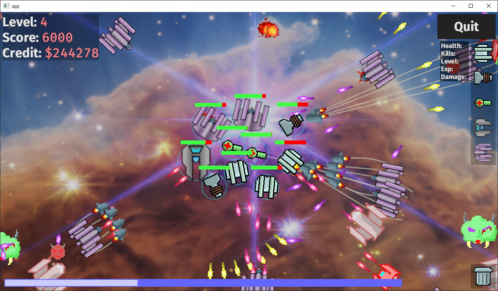

# turrets-rs

This is a port (or rather recreation) of [turrets](https://github.com/msakuta/turrets) game
that I made in JavaScript 8 years ago.

Try it now on your browser! https://msakuta.github.io/turrets-rs/

Many things have changed since then. JavaScript became more sophisticated and heavy.
And I feel limited in maintaining JavaScript project as it scales.

It uses [Bevy](https://bevyengine.org/) game engine.

## Game state

The game state is saved to:
* the local file named "save.json", if it was native build
* the browser's localStorage, if it was Wasm build

The game is loaded at the start of the application and automatically saved on stage clear.
If you exit before a stage finishes, the progress will roll back to the beginning of the stage.

## Build native game

Install Rust.

Compile and run

    cargo r

## Build Wasm version

Follow [Bevy's Wasm example](https://github.com/bevyengine/bevy/tree/latest/examples#wasm) to build and deploy.

Install `wasm-bindgen`

    cargo install wasm-bindgen-cli

Build Wasm binary

    cargo build --release --target wasm32-unknown-unknown

Generate bundling code

    mkdir pkg
    wasm-bindgen --out-name wasm_example --target web --out-dir pkg ./target/wasm32-unknown-unknown/release/turrets-rs.wasm

Browse [index.html](index.html).
Your browser will probably refuse to load Wasm binary served from local file system.
In that case, 

* use `npx serve` if you are a Node.js user, or
* `python -m http.server` if your are a Python user, or
* use [Live Server](https://marketplace.visualstudio.com/items?itemName=ritwickdey.LiveServer) if you are a VSCode user, or
* use whatever your favourite web server application that can host from your
local filesystem.

## Image credit

Background image obtained and modified from [NASA and STScI, James Webb Space Telescope](https://webbtelescope.org/contents/media/images/2022/031/01G77PKB8NKR7S8Z6HBXMYATGJ),
according to the [public domain use policy](https://webbtelescope.org/copyright).

## My impression on Bevy Wasm build target

It works with the exactly the same code as native application, which is
impressive, but the binary size is too big.
A simple game like this weighs 15MB.

Another game project of mine called [FactorishWasm](https://github.com/msakuta/FactorishWasm)
also builds to a Wasm module, but I implemented everything without
a game engine, and the binary size is 638KB.
(Of course, it is not a fair comparison - FactorishWasm uses quite some JavaScript
code to implement GUI, which weighs few hundred kilobytes.)

I hope the compiler and libraries will be optimized so that it can produce compact binary
suitable for distributing on the web.
